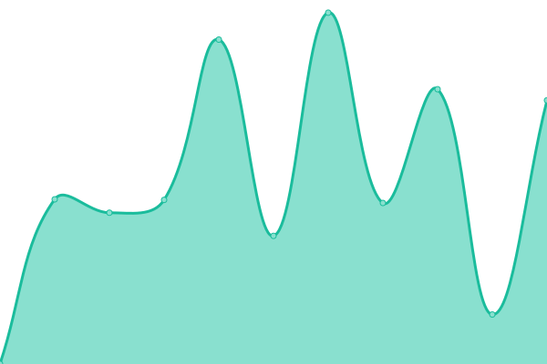

# [📈 Live Status](https://vicpiri.github.io/upptime): <!--live status--> **🟧 Partial outage**

This repository contains the open-source uptime monitor and status page for [vicpiri](https://vicpiri.github.io/upptime), powered by [Upptime](https://github.com/upptime/upptime).

With [Upptime](https://upptime.js.org), you can get your own unlimited and free uptime monitor and status page, powered entirely by a GitHub repository. We use [Issues](https://github.com/vicpiri/upptime/issues) as incident reports, [Actions](https://github.com/vicpiri/upptime/actions) as uptime monitors, and [Pages](https://vicpiri.github.io/upptime) for the status page.

<!--start: status pages-->
<!-- This summary is generated by Upptime (https://github.com/upptime/upptime) -->
<!-- Do not edit this manually, your changes will be overwritten -->
<!-- prettier-ignore -->
| URL | Status | History | Response Time | Uptime |
| --- | ------ | ------- | ------------- | ------ |
|  [Moon-brain](https://moon-brain.com) | 🟩 Up | [moon-brain.yml](https://github.com/vicpiri/upptime/commits/HEAD/history/moon-brain.yml) | 

 640ms
     
 | 

<a href="https://vicpiri.github.io/upptime/history/moon-brain">100.00%</a>
    

|  [Matriculación Marxadella](https://marxadella.ddns.net) | 🟥 Down | [matriculacion-marxadella.yml](https://github.com/vicpiri/upptime/commits/HEAD/history/matriculacion-marxadella.yml) | 

 0ms
     
 | 

<a href="https://vicpiri.github.io/upptime/history/matriculacion-marxadella">0.00%</a>
    

|  [Marxadella.com](https://marxadella.com) | 🟥 Down | [marxadella-com.yml](https://github.com/vicpiri/upptime/commits/HEAD/history/marxadella-com.yml) | 

 3176ms
     
 | 

<a href="https://vicpiri.github.io/upptime/history/marxadella-com">87.91%</a>
    

|  [Mas que foto](https://masquefoto.net) | 🟩 Up | [mas-que-foto.yml](https://github.com/vicpiri/upptime/commits/HEAD/history/mas-que-foto.yml) | 

 472ms
     
 | 

<a href="https://vicpiri.github.io/upptime/history/mas-que-foto">100.00%</a>
    

<!--end: status pages-->

[**Visit our status website →**](https://vicpiri.github.io/upptime)

## 📄 License

- Powered by: [Upptime](https://github.com/upptime/upptime)
- Code: [MIT](./LICENSE) © [vicpiri](https://vicpiri.github.io/upptime)
- Data in the `./history` directory: [Open Database License](https://opendatacommons.org/licenses/odbl/1-0/)
